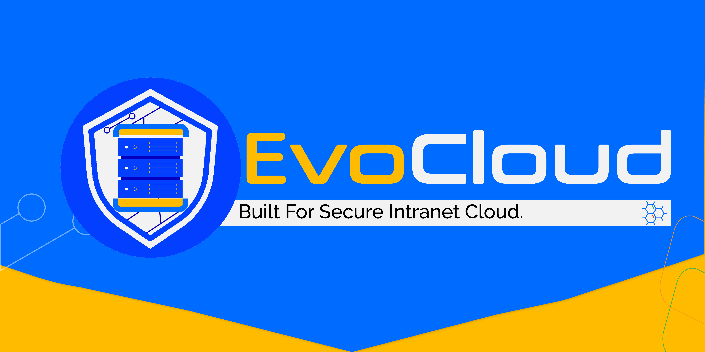
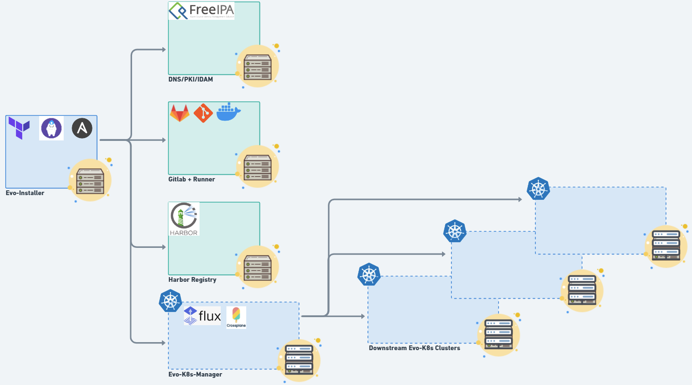
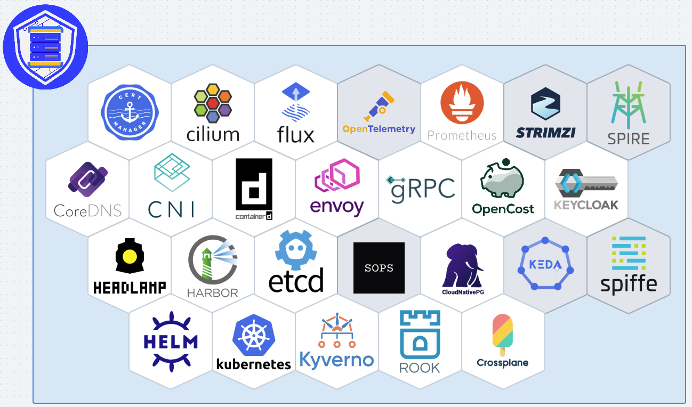

## EvoCloud
EvoCloud-PaaS is a secure by design platform for running and managing cloud native applications in your intranet.

## EvoCloud-PaaS Architecture
The Right to Bear Cloud has been made easy with EvoCloud-PaaS, a Platform stack built for secure intranet Cloud. We leverage a minimalistic, Cloud optimized, and immutable Operating System with the latest Linux kernel to provide an environment for running hassle-free Cloud-native applications. Within the EvoCloud Platform Stack you get the following functions and default features:
- **A DNS, PKI, Kerberos, Dogtag, IDAM Infrastructure:** for identity and single sign-on management, certificates management, DNS resolution, Network time synchronization and Kerberos Ticket Granting.
- **A Platform for Managing DevSecOps:** with source code repository management, CI/CD pipelines for managing automated workflows, and a package registry for managing artifacts.
- **An OCI Compliant registry:** for OCI artifacts such as container images, helm charts, and other OCI compliant artifacts.
- **A Kubernetes management platform:** with tools and custom resource definitions needed to deploy downstream Kubernetes clusters on IaaS agnostic infrastructure. All the Kubernetes infrastructures come in ready to host production Cloud-native applications with CSI providers in place, data in transit and data at rest encryption, CNI fabric, Policy engine for policy enforcement, Audits and Monitoring for compliance, Tracebility and Observability.
- **SaaS specialized services:** such as Database as a Service, event-driven applications and data processing, and others...

## We Play Nice with the CNCF Foundation
EvoCloud-PaaS plays well with other CNCF projects. We integrate the following core technologies from the Cloud-native foundation to bring you a robust platform built on trusted and vetted solutions.

## Licensing
Evocloud-PaaS automation code is under the Mozilla Public License version 2.0 (MPL-2.0).

